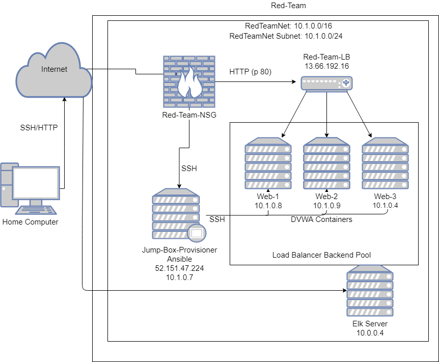

## Automated ELK Stack Deployment

The files in this repository were used to configure the network depicted below.

These files have been tested and used to generate a live ELK deployment on Azure. They can be used to either recreate the entire deployment pictured above. Alternatively, select portions of the yaml file may be used to install only certain pieces of it, such as Filebeat.

  - install-elk.yml

This document contains the following details:
- Description of the Topologu
- Access Policies
- ELK Configuration
  - Beats in Use
  - Machines Being Monitored
- How to Use the Ansible Build

### Description of the Topology

The main purpose of this network is to expose a load-balanced and monitored instance of DVWA, the D*mn Vulnerable Web Application.

Load balancing ensures that the application will be highly available, in addition to restricting access to the network.
- Load Balancers protect Availability in making sure that if one server is down, it can redirect to another still up. An advantage to using a jump box is higher protection as it can be a buffer between a computer and the network.

Integrating an ELK server allows users to easily monitor the vulnerable VMs for changes to the logs and system traffic.
- Filebeat monitors log files or locations that are specified by whomever configures it.
- Metricbeat takes the metrics and stats ships them to whichever output you specify

The configuration details of each machine may be found below.
_Note: Use the [Markdown Table Generator](http://www.tablesgenerator.com/markdown_tables) to add/remove values from the table_.

| Name     | Function | IP Address | Operating System |
|----------|----------|------------|------------------|
| Jump Box | Gateway  | 10.1.0.7   | Linux            |
| Web-1    |Web Server| 10.1.0.8   | Linux            |
| Web-2    |Web Server| 10.1.0.9   | Linux            |
|Elk-Server|Monitoring| 10.0.0.4   | Linux            |

### Access Policies

The machines on the internal network are not exposed to the public Internet. 

Only the Jumpbox machine can accept connections from the Internet. Access to this machine is only allowed from the following IP addresses:
- 68.109.91.105

Machines within the network can only be accessed by the Jumpbox.
- My Jumpbox(10.1.0.7) was the only machine to have access to the ELK server.

A summary of the access policies in place can be found in the table below.

| Name     | Publicly Accessible | Allowed IP Addresses |
|----------|---------------------|----------------------|
| Jump Box | Yes                 | 68.109.91.105        |
|Web-1/2/3 | No                  | 10.1.0.7             |
|Elk-Server| Yes                 | 68.109.91.105        |

### Elk Configuration

Ansible was used to automate configuration of the ELK machine. No configuration was performed manually, which is advantageous because...
- When automated it makes the task quite simple, and no special coding skills are necessary.

The playbook implements the following tasks:
- Install docker.io, python3-pip, and docker module
- Increase and use more virtual memory
- Download and launch docker elk container.

### Target Machines & Beats
This ELK server is configured to monitor the following machines:
- 10.1.0.8 & 10.1.0.9

We have installed the following Beats on these machines:
- Filebeat and Metricbeat

These Beats allow us to collect the following information from each machine:
- Filebeat collects logs and Metricbeat collects metrics and stats.

### Using the Playbook
In order to use the playbook, you will need to have an Ansible control node already configured. Assuming you have such a control node provisioned: 

SSH into the control node and follow the steps below:
- Copy the filebeat.yml file to /etc/ansible/files .
- Update the config file to include the ELK Server IP to the elasticsearch and Kibana parts of the file.
- Run the playbook, and navigate to the ELK Server to check that the installation worked as expected.
_
- _Which file is the playbook? Where do you copy it?_ 
  filebeat-playbook.yml, /etc/ansible/files/filebeat-config.yml
- _Which file do you update to make Ansible run the playbook on a specific machine? How do I specify which machine to install the ELK server on versus which to install Filebeat on?_ 
  The hosts and config file are updated to make sure the right machines are properly configured
- _Which URL do you navigate to in order to check that the ELK server is running?
  http://13.67.216.98:5601/app/kibana